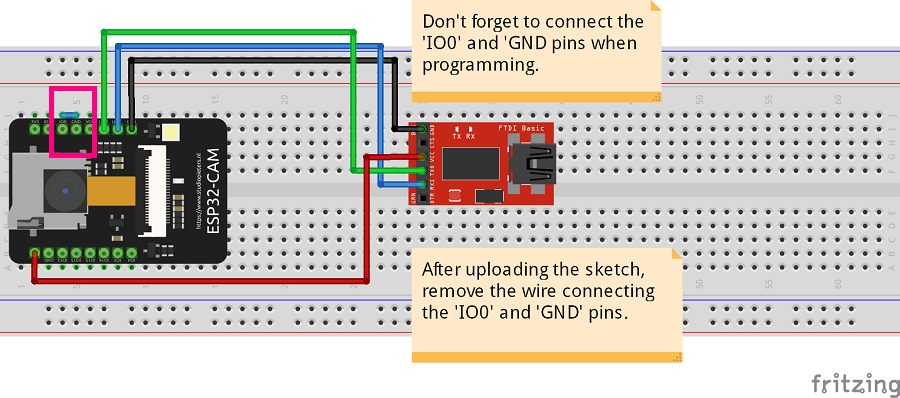
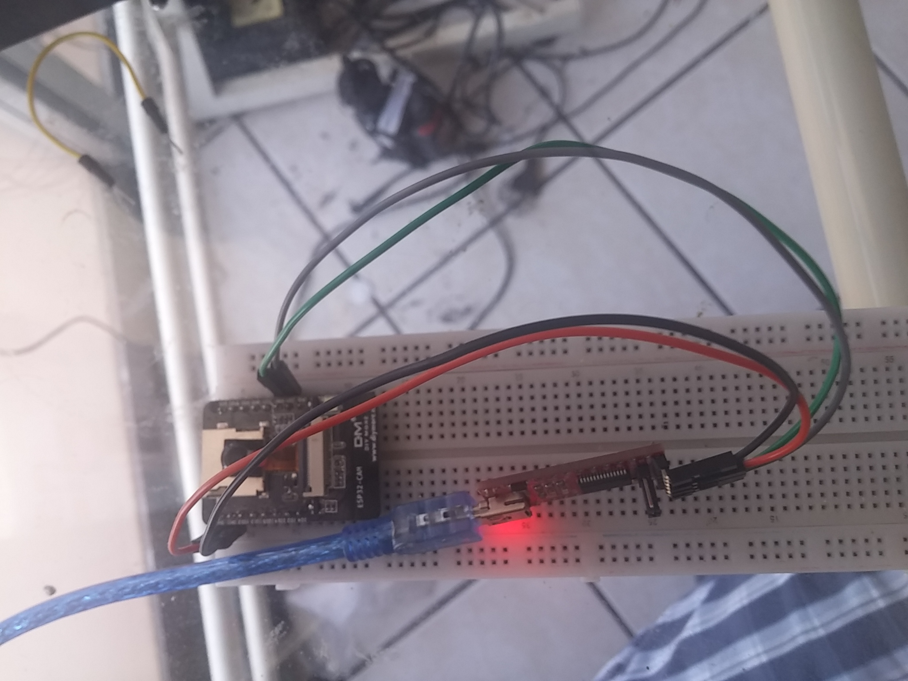

# Basic ESP32-CAM sketch       
       

## About the sketch presented here:        
 - Script based on the fantastic tutorial "ESP32-CAM Take Photo and Save to MicroSD Card" written by **Rui Santos** at **Random Nerd Tutorials**       
 - Original tutorial in: https://randomnerdtutorials.com/esp32-cam-take-photo-save-microsd-card/       
        

## Activities of the sketch:        
 - The original sketch, written by Rui Santos, the ESP32-CAM takes a picture and then enters in **sleep mode**.      
 - The sketch here implements a slight modification. Now, **the ESP32-CAM doesn't goes to the sleep mode after taking a picture**.     
 - It takes a picture every 60 seconds and saves it in the MicroSD card attached to the ESP32-CAM.          
      

# Pictures:      
      

## Circuit for uploading the sketch to the ESP32-CAM:       
         
	
 - The diagram above uses an FT232R programmer to upload the sketch to the ESP32-CAM.         
 - Connections:        
	- **`IO0`** (ESP32-CAM) - **`GND`** (ESP32-CAM)       
	- **`GND`** (FT232R programmer) - **`GND` pin** (ESP32-CAM)      
	- **`VCC`** (FT232R programmer) - **`5V` pin** (ESP32-CAM)     
	- **`TX`** (FT232R programmer) - **`U0R` pin** (ESP32-CAM)      
	- **`RX`** (FT232R programmer) - **`U0T` pin** (ESP32-CAM)      
	

## Pictures:         
         
        
 - The picture above shows the ESP32-CAM in programming mode, using a FT232R programmer module.           
 - Don't forget to connect the `IO0` and `GND` pins of the ESP32-CAM (yellow wire in the picture abore).        
          

         
      
 - After uploading the sketch to the ESP32-CAM, disconnect it from the PC and remove the yellow wire.     
 - Then, connect it again to the PC (or in power) and then it will work!        
 - It will take a picture every 60 seconds and save then in the attached MicroSD card.      
        

	 